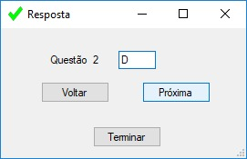
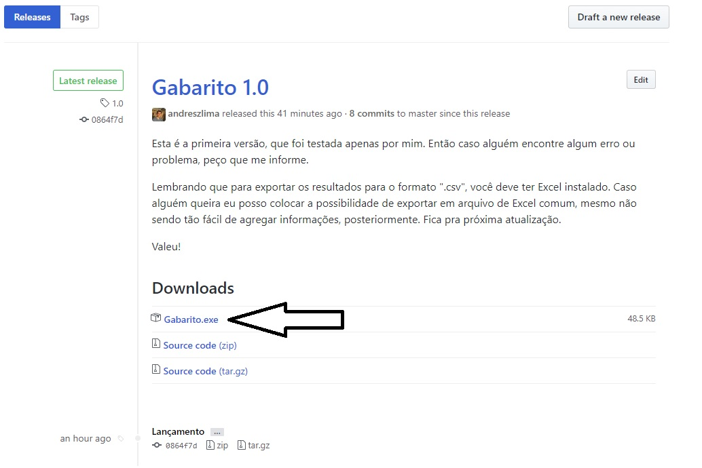

## Resumo

Este programa foi criado com o intuito de acompanhar a resolução de questões em fontes onde isso já não é feito automaticamente, como na resolução de questões provenientes de arquivos de PDF, por exemplo. É um programa simples, mas faz o que não achei em nenhum outro lugar.

Início:

Coloque suas respostas:

Coloque as respostas do gabarito:

Resultado final:

## Funcionalidades

### Quantidade de questões

A quantidade de questões é ilimitada, basta você ter força de vontade para resolver o quanto quiser. Também foi incluída a funcionalidade de começar a resolução em qualquer questão, para casos em que você está começando a resolver pela questão de número 250, por exemplo.

### Se eu errar ao inserir minha resposta, já era?

Não, se errar você só precisa clicar no botão "Voltar" e responder novamente a questão anterior. Isso vale para qualquer questão, só tome cuidado que as questões mais recentes serão apagadas e você deverá inserir elas novamente, conforme for voltando no número de questões.

### E os resultados?

Os resultados são exibidos após inserir todas as respostas suas e do gabarito. Lá será exibido o número de acertos, de erros e o aproveitamento total. Além disso, é possível exportar este resultado para o formato ".csv" (acrescentarei outros formatos, como .xlsx na próxima atualização), para que seja feito o acompanhamento do aproveitamento.

## Motivação

Eu precisava anotar minhas respostas em um arquivo de texto (ou papel), depois precisava ver as respostas do gabarito, uma por uma... Isso era chato, demorado e passível de erros. Procurei soluções para isso e não encontrei nem em sites nem em softwares, então resolvi criar um.

## Uso

Não é necessário instalar nada. Basta abrir o arquivo executável, que pode ser baixado aqui: https://github.com/andreszlima/Gabarito/releases

Caso não saiba qual é o arquivo, ele será o único arquivo executável (.exe). Procure sempre o mais atualizado:

## License

A licença de uso é MIT. Você pode usar, modificar, publicar, vender, fazer o que quiser. Para mais informações, leia: [License.md](LICENSE.md)
